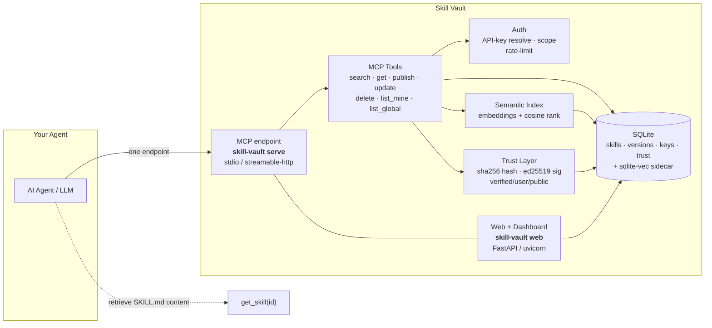

<p align="center">
  
</p>

<h1 align="center">Skill Vault</h1>

<p align="center">
  <b>A self-hostable, semantic skill registry for AI agents — over a single MCP endpoint.</b><br/>
  Query the skills you need when you need them. Keep context small. Trust what you pull.
</p>

<p align="center">
  <a href="https://www.apache.org/licenses/LICENSE-2.0"></a>
  <a href="https://www.python.org/"></a>
  <a href="https://www.python.org/"></a>
  <a href="https://pytest.org/"></a>
  <a href="https://pytest.org/"></a>
  <a href="https://github.com/vikasudasi/skill-vault/actions"></a>
</p>

---

# Skill Vault

Stop shipping a thousand skill files into your agent's context. Point your agent at **one** MCP endpoint; it pulls exactly the skills it needs, on demand, and can verify they haven't been tampered with.

- **One endpoint.** `search_skills("postgres schema migration")` → ranked, lightweight skill *cards* → `get_skill(id)` for the full body only when needed.
- **Private + public.** Every agent gets its own personal skill vault *and* read access to a curated global store.
- **Trusted supply chain.** Skills are content-addressed (sha256) and optionally ed25519-signed. A `verified` tier means a curator vouched for the content — not just that someone uploaded it.
- **Self-hosted.** SQLite + local embeddings + optional pgvector. No managed service, no third party sees your skills, no per-query cost.

---

<details>
<summary><b>📚 Table of Contents</b></summary>

1. [The Problem](#the-problem)
2. [The Solution](#the-solution)
3. [Features](#features)
4. [Why Skill Vault](#why-skill-vault) *(positioning vs skills-mcp / agentregistry)*
5. [Architecture](#architecture)
6. [Quickstart](#quickstart)
7. [MCP Configuration](#mcp-configuration)
8. [Trust & Security Model](#trust--security-model)
9. [API Reference](#api-reference)
10. [CLI](#cli)
11. [Roadmap](#roadmap)
12. [FAQ](#faq)
13. [Contributing](#contributing)
14. [License](#license)

</details>

---

## The Problem

**Every skill costs context.** Progressive-disclosure skill systems pay roughly **~50 tokens per skill** just to keep the *description* in context, and far more for the full instructions.

| # of skills in context | ~tokens of pure skill metadata |
|---|---|
| 100 | 5k |
| 1,000 | 50k |
| 10,000 | **500k+ — exceeds most context windows** |

Local skill files don't sync across machines, teams, or agents. Thousands of files also become a maintenance nightmare — duplicated, stale, unversioned, and unverified (you have no idea who wrote them or whether they're safe to follow).

---

## The Solution

Skill Vault is a **registry + retrieval layer**, not another file format.

- Skills live in a centralized, versioned, content-addressed store.
- The agent wires in **exactly one MCP endpoint**.
- `search_skills(query)` returns light **cards** (name + one-liner + trust tier + cosine score) — cheap.
- `get_skill(id)` returns the **full SKILL.md body** only for the skill the agent actually wants.
- A **personal vault** lets each agent push its own hard-won capabilities and pull them back anywhere, alongside the curated global library.

The result: an agent with access to **10,000 skills** carries only **~50 tokens** of registry description in context, and retrieves the one it needs *at the moment it needs it*.

---

## Features

- 🧭 **Semantic search** — local `all-MiniLM-L6-v2` embeddings (384-d) over skill name, description, tags, and triggers; ranked by cosine similarity. Embed *metadata*, not whole bodies, to keep the index small.
- 🔑 **Per-agent identity** — API keys (sha256-at-rest, shown once at onboarding) with `global` / `personal` / owner-only scope enforcement at the tool layer.
- 📦 **Private skill vaults** — every agent publishes and retrieves its own skills; cross-agent private access is always denied.
- 🔏 **Trust & supply chain** — sha256 content hashing (integrity pin) + optional ed25519 signatures. Trust tiers: `verified` (curator-signed) · `user` (owner's own) · `public` (community).
- 🧬 **Versioned & immutable** — skills are versioned, content-addressed, forward-only. Previous versions remain addressable and hash-pinned.
- 🖥️ **Web dashboard + homepage** — agent management, onboarding, per-agent skill browser, key rotation/revocation, and a ready-to-copy `/configure` guide.
- 🍱 **17 curated seed skills** (with one `verified` sample) so the registry is useful out of the box.
- 🚀 **Self-hosted & transport-flexible** — stdio for local agents, streamable-HTTP/SSE for remote. SQLite + sqlite-vec by default; pgvector drop-in for scale-out.

---

## Why Skill Vault

There are two adjacent tools worth benchmarking against. We occupy the open middle: **self-hosted + per-agent identity + verifiable supply chain.**

| Dimension | **Skill Vault** | skills-mcp | agentregistry |
|---|---|---|---|
| Hosting | **Self-hosted** (your infra) | Managed (Cloudflare Worker) | Self-hosted (org) |
| Vector store | **SQLite + sqlite-vec** (or pgvector) | Qdrant (managed) | Varies |
| Embeddings | **Local, free, private** | Managed API | — |
| Per-agent identity | ✅ **Yes** (API key, hash-at-rest) | ❌ No (shared public library) | Partially (org accounts) |
| Private per-agent vault | ✅ **Yes** | ❌ No | ❌ Not per-agent |
| Trust / supply chain | ✅ **verified/user/public + ed25519 sigs** | ⚠️ Limited | ⚠️ Governance only |
| Content integrity | ✅ **sha256 + client verification** | ❌ | ⚠️ |
| Skill versioning | ✅ **Immutable versions** | Partially | Yes |
| Primary purpose | **Capability registry + retrieval** | Shared free skill library | Org catalog/governance |

**The short version:** *skills-mcp* is a big shared library with no identity and no verification; *agentregistry* is org governance with no per-agent personal vaults. **Skill Vault is both a personal capability vault and a verifiable public registry** — for a single agent or a whole team, on your own hardware.

---

## Architecture



**Flow:** the agent calls the MCP endpoint once → the tool layer authenticates the caller and enforces scope → the semantic index ranks matching skill *cards* → the trust layer reports + verifies integrity → SQLite persists everything. For full-body retrieval, `get_skill(id)` re-derives the content hash and **refuses to return tampered content**.

Two processes share one data path: `skill-vault serve` (MCP, `:8000/mcp`) and `skill-vault web` (dashboard, `:8080`).

---

## Quickstart

### From source

```bash
git clone https://github.com/vikasudasi/skill-vault.git
cd skill-vault
make install              # creates .venv + installs deps

# 1. Initialize the database
.venv/bin/skill-vault init

# 2. Seed the curated library (17 skills, incl. 1 verified)
.venv/bin/skill-vault seed

# 3. Run the local MCP server (stdio) for one agent
.venv/bin/skill-vault serve
```

For a remote/HTTP setup (web + MCP):

```bash
.venv/bin/skill-vault serve --transport streamable-http   # :8000/mcp
.venv/bin/skill-vault web                                  # :8080
```

### Docker

```bash
docker compose up --build
# MCP streamable-http: http://localhost:8000/mcp
# Dashboard:          http://localhost:8080/dashboard
```

### Create your first agent + key

```bash
.venv/bin/skill-vault onboard --name "my-agent"
# prints a raw api key (sv_...) ONCE — save it
```

Or via the dashboard: `http://<host>:8080/dashboard/onboard`

---

## MCP Configuration

Add Skill Vault to any MCP-capable client. **Server name:** `skill-vault`.

### Local / stdio

```json
{
  "mcpServers": {
    "skill-vault": {
      "command": "/absolute/path/to/.venv/bin/skill-vault",
      "args": ["serve"]
    }
  }
}
```

### Remote / streamable-http

```json
{
  "mcpServers": {
    "skill-vault": {
      "url": "https://your-host/mcp",
      "headers": { "Authorization": "Bearer sv_YOUR_AGENT_KEY" }
    }
  }
}
```

> **Auth note:** Skill Vault passes the agent key as a **per-tool argument** (`agent_key=...`) for private/global operations — no connection-level key header is strictly required. On streamable-http, forward the `Authorization` header for convenience.

On the running instance, the `/configure` page renders copy-paste-ready snippets for both transports.

---

## Trust & Security Model

### Integrity (content-addressed)

Every skill version stores `content_hash = sha256(canonical(skill))`. On `get_skill`, the server **re-derives** the hash and compares — if the stored body doesn't match its pin, the server raises `SV_INTEGRITY` and never returns tampered content.

### Signatures (verifiable supply chain)

Skills can additionally carry an **ed25519 signature** over the canonical payload, produced by a curator holding `SKILL_VAULT_CURATOR_KEY`. Consumers call `verify` (or read the `verified` flag on `get_skill`) before following a pulled skill.

### Trust tiers

| Tier | Meaning |
|---|---|
| `verified` | Curator-signed — a known verifier vouched for the exact content |
| `user` | Owner's own personal skill |
| `public` | Community/global, unsigned |

Hosts control what they serve via `SKILL_VAULT_TRUST_ALLOW` (default `verified,user`). The trust scope/crypto is policy-driven so enterprise governance (RBAC/audit/policy) can be layered on without rearchitecting.

### Security posture

- API keys stored **sha256-hashed only** — raw keys never persisted, shown once at onboarding.
- Per-key **rate limiting** on the public endpoint.
- Dashboard uses **HTTP Basic** with credentials distinct from agent keys.
- Remote access expected behind **TLS** (Caddy/nginx/Traefik) — see [Deployment](docs/DEPLOYMENT.md).
- Vulnerability reporting: see [SECURITY.md](SECURITY.md).

---

## API Reference

All tools return a JSON tool-result. Errors use stable codes.

| Code | Meaning |
|---|---|
| `SV_UNAUTHENTICATED` | Missing/invalid agent key |
| `SV_FORBIDDEN` | Valid key, no access (cross-agent/private) |
| `SV_NOT_FOUND` | Skill/version not found |
| `SV_INVALID_SKILL` | Malformed skill / missing required frontmatter |
| `SV_INTEGRITY` | Content hash mismatch (tamper) |
| `SV_RATE_LIMITED` | Key over quota |
| `SV_CONFLICT` | Duplicate name in scope |

### `search_skills(query, scope="global", limit=10, min_trust=None, agent_key=None)`
Semantic search. Returns lightweight **cards** `(id, name, description, tags, trust, score, version)`. `scope`: `global` (no key needed) · `all` / `personal` (requires `agent_key`).

### `get_skill(id, version=None, agent_key=None)`
Full SKILL.md body + `{trust, verified, content_hash}`. Re-verifies integrity; raises `SV_INTEGRITY` on mismatch. Global skills readable by anyone; personal only by owner.

### `publish_skill(skill, visibility="personal", agent_key)`
`skill = {name, description, tags[], triggers[], body, meta{}}`. Creates a new skill (version 1, hashed, `user` or `public` tier). `SV_CONFLICT` if name exists in the agent's scope — use `update_skill`.

### `update_skill(id, skill, agent_key)`
Owner/curator only. Appends a new **immutable version** (`version = max+1`), updates `current_version_id`. Previous versions stay addressable and hash-pinned.

### `delete_skill(id, agent_key)`
Owner-only removal (keeps version history for audit).

### `list_my_skills(agent_key, scope="all")`
Cards (no bodies) for the authenticated agent's personal vault (+ optionally global).

### `list_global_skills(limit=20, offset=0)`
Paged cards from the curated global store — no key needed.

---

## CLI

```
skill-vault init          Initialize DB + apply migrations
skill-vault migrate       Apply pending forward-only migrations
skill-vault onboard       Create an agent + issue first API key (shown once)
skill-vault whoami        Resolve an API key to an identity
skill-vault seed          Seed curated skills from the library (--curator-key to sign)
skill-vault reindex       (Re)embed skill versions into the vector index
skill-vault verify        Check integrity + signature for a skill version
skill-vault curator gen-key   Generate a curator ed25519 keypair
skill-vault serve         Run the MCP server (stdio or --transport streamable-http)
skill-vault web           Run the web dashboard (FastAPI/uvicorn)
skill-vault backup        Snapshot DB + vector sidecars
skill-vault restore       Restore a snapshot
```

Examples:

```bash
# Sign seed skills as verified
export SKILL_VAULT_CURATOR_KEY="<base64 ed25519 privkey>"
.venv/bin/skill-vault seed

# One-command public launcher (no systemd)
./scripts/run-public.sh
```

---

## Roadmap

**Now / current release (v0.1)**
- ✅ Core MCP registry + semantic search + auth + trust
- ✅ Web dashboard, homepage, `/configure`
- ✅ Deployment (two-process, Docker, systemd, backup/restore)
- ✅ Test suite (111 tests, 88% cov) + CI
- ✅ Seed library (17 skills)

**Next**
- 📦 Release automation, signed release tags, PyPI publishing
- 🧪 More curated skills + community submission flow
- 🔬 pgvector backend hardening + horizontal scale notes
- 📊 Usage analytics / skill health signals

**Later (open-core tier, monetization deferred)**
- 🔐 Org governance: SSO, RBAC, audit, compliance policies
- 🤖 Shared public library federation / multi-tenant hosting
- 🔌 Native agent integrations beyond the MCP tool surface

---

## FAQ

**Q: How is this different from just pasting a folder of skills into my agent?**
A: A folder floods context with every skill's description (~50 tokens each) and doesn't sync or verify. Skill Vault keeps only a tiny registry endpoint in context and retrieves the one skill you need *at the moment* — verified.

**Q: Do I need a GPU or an embedding API key?**
A: No. Embeddings run locally via `all-MiniLM-L6-v2` (sentence-transformers). Works on a CPU-only box.

**Q: Is my data sent anywhere?**
A: No third party *by default*. Everything runs on your host; the default vector backend is local SQLite. (If you opt into `pgvector`, it goes to your own Postgres.)

**Q: Who can see my personal skills?**
A: Only you. Cross-agent private access is always rejected at the tool layer, and scope filtering happens at query time.

**Q: What does "verified" actually mean?**
A: A skill with a valid ed25519 signature from a curator whose public key you trust. It proves the *exact content* you pulled is what the curator signed — nothing more, nothing less.

**Q: Can one agent access another agent's vault?**
A: No, unless the skills are `global`. Personal scope is owner-only, always.

**Q: How do I run this in production?**
A: See [Deployment](docs/DEPLOYMENT.md) — two processes behind a TLS reverse proxy, with systemd units and a no-systemd fallback launcher.

---

## Contributing

Contributions are welcome! Please see [CONTRIBUTING.md](CONTRIBUTING.md) for the full guide.

**Quick pointers:**
- Python ≥ 3.11, `from __future__ import annotations`, type hints throughout.
- Run the gates before submitting: `make check` (ruff + format + mypy) and `pytest` with ≥85% coverage.
- Add skills to `skill_vault/data/skills/` (see the format of existing entries) and run `skill-vault seed` to ingest.
- Open an issue first for behaviour changes; keep PRs focused.

---

## License

Copyright © 2026 Vik Udasi. Licensed under the **Apache License, Version 2.0**. See [LICENSE](LICENSE). You may use, modify, and distribute this software, including in commercial products; attribution required.
